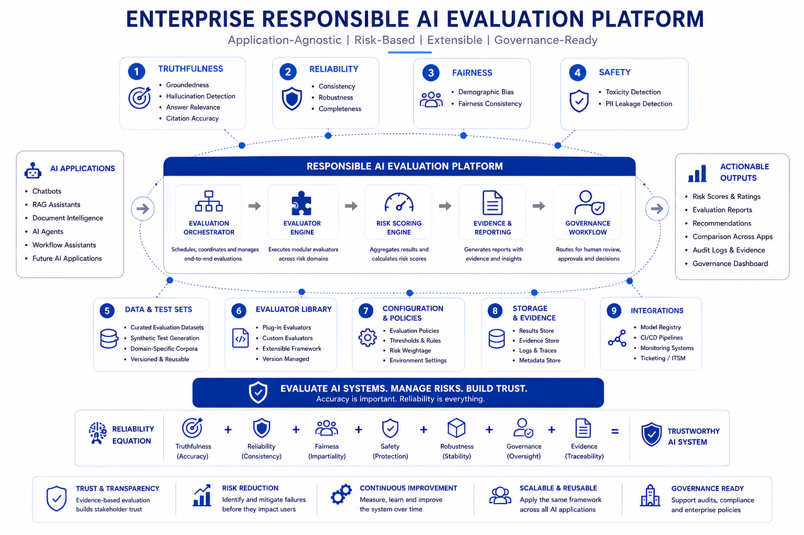

# Enterprise Responsible AI Evaluation Platform

## Overview

The Enterprise Responsible AI Evaluation Platform is a modular framework for evaluating Generative AI systems across multiple Responsible AI risk domains.

The framework provides a common foundation for implementing evaluators, executing benchmarks, standardizing evaluation results, and documenting architectural decisions. It brings together reusable framework components, benchmark datasets, supporting documentation, and representative use cases into a single repository.

The current implementation includes baseline evaluators for truthfulness, reliability, fairness, and safety, along with a benchmark framework and architecture documentation. The framework is structured to support additional evaluation techniques, reporting capabilities, and integrations as the project evolves.

---

## Architecture & Documentation

The repository includes supporting documentation that captures the architectural decisions, evaluation workflows, and design considerations behind the framework.

| Documentation                                                                  | Description                                 |
| ------------------------------------------------------------------------------ | ------------------------------------------- |
| 🏛 **[Enterprise Architecture](docs/architecture/enterprise_architecture.md)** | High-level platform architecture and design |
| ⚙️ **[Technical Architecture](docs/architecture/technical_architecture.md)**   | Framework components and interactions       |
| 🔄 **[Evaluation Workflow](docs/architecture/evaluation_workflow.md)**         | End-to-end evaluation process               |
| 📊 **[Benchmark Framework](docs/architecture/benchmark_framework.md)**         | Benchmark design and execution              |
| 💼 **[Case Studies](docs/case_studies/README.md)**                             | Example AI evaluation scenarios             |
| 📚 **[Architecture Decisions](docs/architecture/design_decisions.md)**         | Architecture rationale and trade-offs       |


---

## Enterprise Platform Architecture

The platform is organized around reusable framework components instead of application-specific evaluation pipelines.

Core responsibilities are separated into independent layers for evaluation, benchmarking, reporting, and future governance capabilities. This makes it easier to introduce new evaluators and extend the framework without changing the overall architecture.

<p align="center">
    
</p>

For additional details, refer to the architecture documentation included in the repository.

---

## Core Design Principles

The framework has been built around a few guiding principles that have influenced both the architecture and the implementation.

### Standardized Evaluation

All evaluators follow a common request and result model, making evaluation outputs consistent across different risk domains.

### Modular Design

Each evaluator is implemented independently, allowing new evaluation capabilities to be added without impacting existing components.

### Benchmark-Driven Development

Benchmark datasets are treated as part of the framework rather than as standalone examples, enabling consistent validation of evaluators.

### Separation of Concerns

Evaluation logic, orchestration, benchmarks, datasets, reporting, and documentation are maintained independently to keep the framework easy to extend.

### Documentation Alongside Code

Architecture diagrams, workflows, design decisions, and case studies are maintained alongside the implementation to provide context beyond the source code.

---

## Repository Organization

```text
enterprise-rai-evaluation-platform/

├── core/
│   Shared framework abstractions
│
├── evaluators/
│   Responsible AI evaluators organized by domain
│
├── benchmarks/
│   Benchmark execution framework
│
├── datasets/
│   Sample benchmark datasets
│
├── docs/
│   Architecture, workflows, case studies, and research
│
├── examples/
│   Example AI evaluation scenarios
│
├── integrations/
│   External framework integrations
│
├── runners/
│   Benchmark runners
│
└── tests/
│   Unit and integration tests
```

The repository is organized around reusable platform capabilities, making it easier to extend the framework as new evaluators, benchmarks, and integrations are added.

---

## Current Implementation

### Framework Components

* Standardized evaluation request and result models
* Modular evaluator architecture
* Benchmark execution framework
* Dataset loading utilities
* Risk classification
* Evaluation orchestration

### Implemented Evaluators

**Truthfulness**

* Groundedness
* Hallucination
* Answer Relevance
* Citation Accuracy

**Reliability**

* Completeness

**Fairness**

* Bias

**Safety**

* Toxicity
* PII Leakage
* Prompt Injection

### Currently in Progress

* Enterprise reporting
* Evaluation sessions
* Evaluator registry
* Enhanced benchmark reporting
* HTML report generation

## Responsible AI Evaluation Domains

The framework organizes evaluators into reusable Responsible AI domains instead of application-specific pipelines. This allows the same evaluation approach to be applied consistently across different AI applications while keeping individual evaluators modular and independent.

| Domain           | Focus                              | Current Evaluators                                               |
| ---------------- | ---------------------------------- | ---------------------------------------------------------------- |
| **Truthfulness** | Factual correctness and grounding  | Groundedness, Hallucination, Answer Relevance, Citation Accuracy |
| **Reliability**  | Response quality and completeness  | Completeness                                                     |
| **Fairness**     | Bias and equitable behavior        | Bias                                                             |
| **Safety**       | Harmful content and security risks | Toxicity, PII Leakage, Prompt Injection                          |
| **Governance**   | Auditability and compliance        | Planned                                                          |
| **Operational**  | Runtime quality and monitoring     | Planned                                                          |

---

## Benchmark Framework

The benchmark framework provides a consistent way to validate evaluators using representative datasets.

The current implementation includes:

* Standardized benchmark datasets
* Dataset loading utilities
* Benchmark execution framework
* Standardized evaluation requests and results
* Risk classification
* Benchmark summaries

The framework has been designed so that additional evaluators and datasets can be added without changing the benchmark execution process.

---

## Example Applications

The framework is application-agnostic and can be applied across different Generative AI solutions.

Example scenarios include:

* Retrieval-Augmented Generation (RAG)
* Document Intelligence
* Enterprise Knowledge Assistants
* Customer Support Chatbots
* AI Copilots
* Agentic AI Systems *(future exploration)*

These examples demonstrate how a common evaluation framework can be reused across different AI applications while maintaining consistent evaluation standards.

---

## Repository Highlights

Some parts of this repository go beyond the evaluator implementations themselves.

Highlights include:

* Enterprise and technical architecture documentation
* Architecture diagrams and evaluation workflows
* Benchmark framework
* Case studies
* Design decisions
* Modular evaluator architecture
* Standardized evaluation models
* Extensible project structure

The goal is to document not only the implementation, but also the architectural decisions behind it.

---

## Roadmap

The project continues to evolve incrementally.

### Current Focus

* Expand evaluator coverage
* Improve benchmark quality
* Strengthen reporting capabilities
* Refine framework architecture

### Future Areas

* Semantic similarity evaluation
* LLM-as-a-Judge evaluators
* Advanced benchmark datasets
* Evaluation dashboards
* Additional Responsible AI domains
* Integration with external evaluation frameworks

The roadmap will continue to evolve as new evaluation techniques and Responsible AI practices emerge.

---

## Repository Purpose

This repository is intended as an engineering project that explores how Responsible AI evaluation can be organized into a reusable and extensible framework.

It combines software engineering practices, Responsible AI concepts, benchmark-driven development, and architecture documentation into a single project that can continue evolving as the Responsible AI landscape matures.
