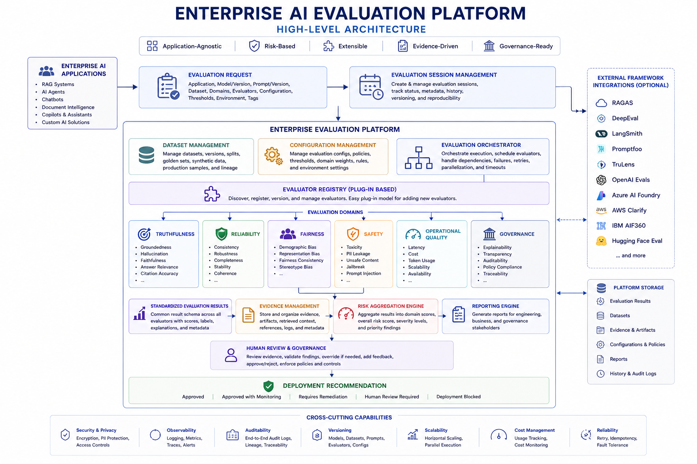

# Enterprise Responsible AI Evaluation Platform

## Overview

## Overview

The Enterprise Responsible AI Evaluation Platform is a modular framework for evaluating Generative AI systems across multiple Responsible AI risk domains.

The goal of this repository is not simply to implement individual evaluators, but to explore how enterprise AI evaluation can be standardized, governed, and organized into a reusable platform that supports multiple AI systems.

As organizations adopt multiple AI applications, evaluation often becomes fragmented across teams, tools, and use cases. This project explores how a common evaluation platform can standardize evaluation through reusable evaluators, benchmark-driven execution, consistent evaluation models, and shared architectural patterns.

The framework is intentionally application-agnostic because many Responsible AI concerns such as truthfulness, safety, fairness, operational quality, and governance are common across different AI applications. By standardizing these evaluation capabilities, the same framework can be applied consistently across chatbots, Retrieval-Augmented Generation (RAG) systems, document intelligence solutions, AI agents, and future AI-powered applications.

The current implementation establishes the core platform through modular evaluators, benchmark execution, standardized evaluation contracts, and supporting architecture documentation. The framework is structured to support additional evaluation techniques, reporting capabilities, and external integrations as it evolves.

---

## Architecture & Documentation

The repository includes supporting documentation that explains the platform architecture, design decisions, evaluation workflow, and supporting research.

| Documentation | Description |
|---------------|-------------|
| 🏛 **[High-Level Architecture](docs/architecture/high_level_architecture.md)** | Enterprise architecture overview |
| 🧩 **[Component Architecture](docs/architecture/component_architecture.md)** | Internal platform components |
| 🔄 **[Evaluation Workflow](docs/architecture/evaluation_workflow.md)** | End-to-end evaluation lifecycle |
| 🚶 **[Architecture Walkthrough](docs/architecture/architecture_walkthrough.md)** | Guided explanation of the platform |
| 🛠 **[Design Principles](docs/architecture/design_principles.md)** | Engineering principles and trade-offs |
| 📚 **[Evaluator Catalog](docs/evaluation/evaluator_catalog.md)** | Catalog of implemented evaluators |
| 💼 **[Enterprise AI Case Studies](docs/research/case_studies.md)** | Real-world AI incidents and lessons learned |
| 🔬 **[Research Notes](docs/research/README.md)** | Research, interview insights, and future ideas |

---

## Platform Architecture

The Enterprise Responsible AI Evaluation Platform provides a common foundation for evaluation orchestration, benchmark execution, evaluator implementations, evidence collection, reporting, and governance.

The architecture is organized around reusable platform components rather than application-specific pipelines, allowing different AI applications to share the same evaluation workflow while supporting organization-specific evaluation policies and future integrations.

For a detailed walkthrough of the architecture, see the documentation linked above.

<p align="center">
  
</p>

Explore the complete architecture:

• [High-Level Architecture](docs/architecture/high_level_architecture.md)

• [Component Architecture](docs/architecture/component_architecture.md)

• [Architecture Walkthrough](docs/architecture/architecture_walkthrough.md)

• [Evaluation Workflow](docs/architecture/evaluation_workflow.md)

---

## Core Design Principles

The framework has been built around a few guiding principles that have influenced both the architecture and the implementation.

### Standardized Evaluation

All evaluators follow a common request and result model, making evaluation outputs consistent across different risk domains.

### Modular Design

Each evaluator is implemented independently, allowing new evaluation capabilities to be added without impacting existing components.

### Benchmark-Driven Development

Benchmark datasets are treated as part of the framework rather than as standalone examples, enabling consistent validation of evaluators.

### Separation of Concerns

Evaluation logic, orchestration, benchmarks, datasets, reporting, and documentation are maintained independently to keep the framework easy to extend.

### Documentation Alongside Code

Architecture diagrams, workflows, design decisions, and case studies are maintained alongside the implementation to provide context beyond the source code.

---

## Repository Organization

```text
enterprise-rai-evaluation-platform/

├── core/
│   Shared framework abstractions
│
├── evaluators/
│   Responsible AI evaluators organized by domain
│
├── benchmarks/
│   Benchmark execution framework
│
├── datasets/
│   Sample benchmark datasets
│
├── docs/
│   Architecture, workflows, case studies, and research
│
├── examples/
│   Example AI evaluation scenarios
│
├── integrations/
│   External framework integrations
│
├── runners/
│   Benchmark runners
│
└── tests/
│   Unit and integration tests
```

The repository is organized around reusable platform capabilities, making it easier to extend the framework as new evaluators, benchmarks, and integrations are added.

---

## Current Implementation

### Framework Components

* Standardized evaluation request and result models
* Modular evaluator architecture
* Benchmark execution framework
* Dataset loading utilities
* Risk classification
* Evaluation orchestration

### Implemented Evaluators

**Truthfulness**

* Groundedness
* Hallucination
* Answer Relevance
* Citation Accuracy

**Reliability**

* Completeness

**Fairness**

* Bias

**Safety**

* Toxicity
* PII Leakage
* Prompt Injection

### Currently in Progress

* Enterprise reporting
* Evaluation sessions
* Evaluator registry
* Enhanced benchmark reporting
* HTML report generation

## Responsible AI Evaluation Domains

The framework organizes evaluators into reusable Responsible AI domains instead of application-specific pipelines. This allows the same evaluation approach to be applied consistently across different AI applications while keeping individual evaluators modular and independent.

| Domain           | Focus                              | Current Evaluators                                               |
| ---------------- | ---------------------------------- | ---------------------------------------------------------------- |
| **Truthfulness** | Factual correctness and grounding  | Groundedness, Hallucination, Answer Relevance, Citation Accuracy |
| **Reliability**  | Response quality and completeness  | Completeness                                                     |
| **Fairness**     | Bias and equitable behavior        | Bias                                                             |
| **Safety**       | Harmful content and security risks | Toxicity, PII Leakage, Prompt Injection                          |
| **Governance**   | Auditability and compliance        | Planned                                                          |
| **Operational**  | Runtime quality and monitoring     | Planned                                                          |

---

## Benchmark Framework

The framework is designed to complement existing evaluation ecosystems rather than replace them. Built-in evaluators can operate alongside external frameworks such as RAGAS, DeepEval, LangSmith, and OpenAI Evals while sharing a common orchestration, reporting, and benchmark infrastructure.

The current implementation includes:

* Standardized benchmark datasets
* Dataset loading utilities
* Benchmark execution framework
* Standardized evaluation requests and results
* Risk classification
* Benchmark summaries

The framework has been designed so that additional evaluators and datasets can be added without changing the benchmark execution process.

---

## Example Applications

The framework is application-agnostic and can be applied across different Generative AI solutions.

Example scenarios include:

* Retrieval-Augmented Generation (RAG)
* Document Intelligence
* Enterprise Knowledge Assistants
* Customer Support Chatbots
* AI Copilots
* Agentic AI Systems *(future exploration)*

These examples demonstrate how a common evaluation framework can be reused across different AI applications while maintaining consistent evaluation standards.

---

## Repository Highlights

Some parts of this repository go beyond the evaluator implementations themselves.

Highlights include:

* Enterprise and technical architecture documentation
* Architecture diagrams and evaluation workflows
* Benchmark framework
* Case studies
* Design decisions
* Modular evaluator architecture
* Standardized evaluation models
* Extensible project structure

The repository is intended to showcase both implementation and system design, illustrating how an enterprise AI evaluation platform can evolve from individual evaluators into a modular, extensible architecture.

---

## Roadmap

The project continues to evolve incrementally.

### Current Focus

* Expand evaluator coverage
* Improve benchmark quality
* Strengthen reporting capabilities
* Refine framework architecture

### Future Areas

* Semantic similarity evaluation
* LLM-as-a-Judge evaluators
* Advanced benchmark datasets
* Evaluation dashboards
* Additional Responsible AI domains
* Integration with external evaluation frameworks

The roadmap will continue to evolve as new evaluation techniques and Responsible AI practices emerge.

---

## Repository Purpose

This repository explores how Responsible AI evaluation can be organized into a reusable enterprise platform rather than a collection of independent evaluation scripts.

The primary focus is on modular architecture, standardized evaluation contracts, benchmark-driven development, and documentation that explains both the implementation and the engineering decisions behind the framework.
