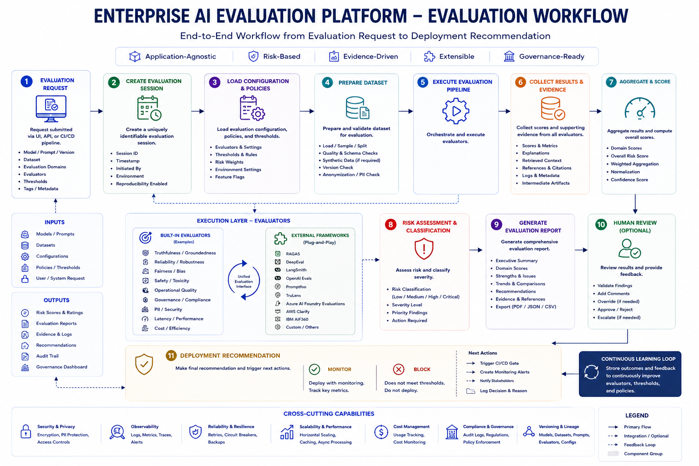

# Enterprise AI Evaluation Platform – Evaluation Workflow

## Overview

The Evaluation Workflow describes the end-to-end execution lifecycle of an AI evaluation, beginning with an evaluation request and ending with a deployment recommendation and continuous learning.

Unlike the High-Level Architecture, which focuses on platform capabilities, and the Component-Level Architecture, which explains the internal building blocks, this document explains **how an evaluation moves through the platform**.

Every evaluation follows the same standardized workflow regardless of the AI application, model, or evaluation framework being used.

---

# Evaluation Workflow

<p align="center">
  
</p>

The diagram above illustrates the end-to-end evaluation lifecycle followed by the Enterprise AI Evaluation Platform. It shows how an evaluation request progresses through configuration, dataset preparation, evaluator execution, evidence collection, risk assessment, reporting, human review, deployment recommendation, and continuous learning.

Unlike the High-Level Architecture, which describes the major platform capabilities, this workflow focuses on **how an evaluation moves through the platform** from start to finish.

---

# End-to-End Workflow

Every evaluation progresses through eleven major stages.

```text
Evaluation Request
        │
        ▼
Create Evaluation Session
        │
        ▼
Load Configuration
        │
        ▼
Prepare Dataset
        │
        ▼
Execute Evaluation Pipeline
        │
        ▼
Collect Results & Evidence
        │
        ▼
Aggregate & Score
        │
        ▼
Risk Assessment
        │
        ▼
Generate Evaluation Report
        │
        ▼
Human Review (Optional)
        │
        ▼
Deployment Recommendation
        │
        ▼
Continuous Learning
```

---

# Step 1 — Evaluation Request

Every evaluation begins with a structured request submitted through a user interface, API, or CI/CD pipeline.

The request defines:

- AI Application
- Model Version
- Prompt Version
- Dataset
- Evaluation Domains
- Selected Evaluators
- Thresholds
- Configuration
- Metadata & Tags

This ensures evaluations are repeatable and fully traceable.

---

# Step 2 — Create Evaluation Session

The platform creates a unique Evaluation Session to manage the lifecycle of the execution.

The session captures:

- Session ID
- Timestamp
- Request Metadata
- Configuration Snapshot
- Execution Status
- Version Information

The session serves as the central object that links every artifact generated during evaluation.

---

# Step 3 — Load Configuration & Policies

Before execution begins, the platform loads all evaluation settings.

This includes:

- Evaluation Policies
- Risk Thresholds
- Domain Weights
- Environment Configuration
- Evaluator Settings
- Feature Flags

Separating configuration from application code enables enterprise customization without software changes.

---

# Step 4 — Prepare Dataset

The dataset is validated and prepared for evaluation.

Typical preparation tasks include:

- Dataset Loading
- Sampling
- Schema Validation
- Dataset Version Verification
- Synthetic Dataset Generation (if required)
- PII Detection & Masking

Only validated datasets proceed to execution.

---

# Step 5 — Execute Evaluation Pipeline

The Evaluation Orchestrator coordinates execution across all selected evaluators.

Responsibilities include:

- Resolving Evaluators
- Preparing Inputs
- Scheduling Execution
- Running Built-in Evaluators
- Running External Frameworks
- Managing Failures & Retries

Evaluation logic remains independent from orchestration logic.

---

# Execution Layer

The platform executes evaluators through a unified evaluation interface.

## Built-in Evaluators

Examples include:

- Truthfulness
- Reliability
- Fairness
- Safety
- Operational Quality
- Governance

## External Frameworks

When enabled, the platform may also execute:

- RAGAS
- DeepEval
- LangSmith
- Promptfoo
- TruLens
- OpenAI Evals
- Azure AI Foundry
- AWS Clarify
- IBM AIF360

The platform treats both built-in and external evaluators consistently through a standardized execution interface.

---

# Step 6 — Collect Results & Evidence

After execution completes, the platform collects all outputs.

Artifacts include:

- Evaluation Scores
- Supporting Evidence
- Explanations
- Retrieved Context
- References
- Logs
- Intermediate Results
- Metadata

These artifacts provide transparency and enable future audits.

---

# Step 7 — Aggregate & Score

Individual evaluator results are normalized and combined into enterprise-level metrics.

The Risk Aggregation Engine computes:

- Domain Scores
- Weighted Scores
- Overall Risk Score
- Confidence Score
- Score Normalization

Organizations may customize aggregation strategies based on business priorities.

---

# Step 8 — Risk Assessment & Classification

The platform transforms evaluation scores into actionable risk assessments.

Outputs include:

- Risk Classification
- Severity Level
- Priority Findings
- Recommended Actions

Risk categories may include:

- Low
- Medium
- High
- Critical

This step enables evaluation results to support deployment decisions.

---

# Step 9 — Generate Evaluation Report

The Reporting Engine creates reports tailored for different stakeholders.

Typical outputs include:

- Executive Summary
- Domain Scores
- Strengths & Weaknesses
- Evidence & References
- Trend Analysis
- Recommendations
- Export Formats (PDF, JSON, CSV)

Reports provide both technical and business perspectives of the evaluation.

---

# Step 10 — Human Review (Optional)

For high-impact AI systems, automated recommendations may require human approval.

Reviewers can:

- Validate Findings
- Review Evidence
- Approve Results
- Reject Results
- Override Recommendations
- Escalate Issues

This Human-in-the-Loop approach supports enterprise Responsible AI governance.

---

# Step 11 — Deployment Recommendation

The final stage determines whether the AI system is ready for deployment.

Possible recommendations include:

- Approved
- Approved with Monitoring
- Requires Remediation
- Human Review Required
- Deployment Blocked

These recommendations can integrate directly with enterprise CI/CD pipelines and governance workflows.

---

# Continuous Learning Loop

Evaluation does not end after deployment.

The platform continuously improves by incorporating:

- Reviewer Feedback
- Production Monitoring
- Updated Policies
- New Evaluation Techniques
- Additional Datasets
- Enhanced Evaluators

This feedback loop enables the platform to evolve alongside enterprise AI systems.

---

# Workflow Outputs

At the conclusion of every evaluation, the platform produces a standardized set of outputs.

These include:

- Risk Scores & Ratings
- Evaluation Reports
- Evidence & Logs
- Recommendations
- Audit Trail
- Governance Dashboard

These outputs support engineering teams, business stakeholders, compliance officers, and governance committees.

---

# Design Principles

The workflow is designed around several core principles:

- Repeatable
- Configurable
- Evidence-Driven
- Human-Centered
- Risk-Based
- Extensible
- Governance-Ready

These principles ensure that evaluations remain consistent, transparent, and scalable across diverse enterprise AI applications.

---

# Relationship to Other Architecture Documents

Each architecture document focuses on a different perspective of the platform.

| Document | Focus |
|----------|-------|
| [High-Level Architecture](high_level_architecture.md) | What the platform does |
| [Component Architecture](component_architecture.md) | How the platform is built |
| [Evaluation Workflow](evaluation_workflow.md) | How evaluations execute |
| [Architecture Walkthrough](architecture_walkthrough.md) | How the platform components collaborate |
| [Design Principles](design_principles.md) | Architectural decisions and engineering principles |

Together, these documents provide a complete understanding of the Enterprise AI Evaluation Platform.